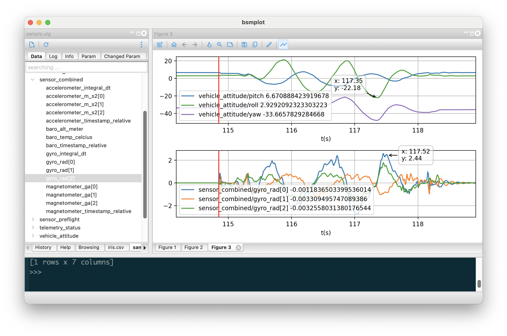

# bsmplot
**bsmplot** is a cross-platform tool to visualize time series based on [Matplotlib](https://matplotlib.org/) and [wxPython](https://wxpython.org/). Supported data source
- VCD (value change dump)
- PX4 [ulog](https://docs.px4.io/main/en/dev_log/ulog_file_format.html)
- CSV
- Matlab .mat
- [ZMQ](https://zeromq.org/) subscriber

To install
```
$ pip install bsmplot
```

</img>
